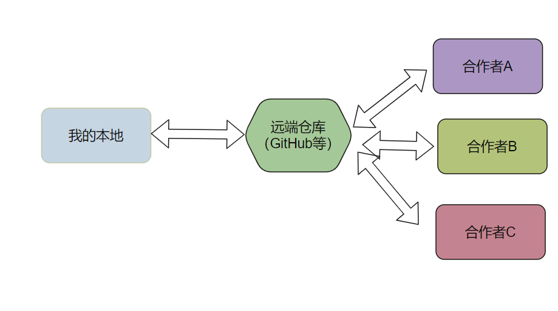

# 1. Git 简介
* 轻量化分布式版本管理系统
* 版本管理
* 迭代开发
* 合作开发


# 2. Git 安装配置

### 2.1. Linux 安装

```bash{.line-numbers}
sudo apt-get install git-all
```

### 2.2. windows 安装

*  下载安装包 https://git-scm.com/download/win 
* 双击安装既可

 
### 2.3. 参数配置

``` bash{.line-numbers}
git config --global user.name "Your Name"
git config --global user.email "email@example.com"
```
实例：


---


# 3. Git 基础概念
## 3.1. Git 分区
分为三个区域；工作区、暂存区、版本区


## 3.2. Git vs GitHub
* Git 是一个本地代码/仓库管理工具
* GitHub是远端代码仓库



___

# 4. Git 版本管理

## 4.1. Git 工程初始化

* 控制台
* git bash


```bash{.line-numbers}
 git init
```
## 4.2. 工作区修改
* 查看工作区修改
```bash{.line-numbers}
git status 
```
* 工作区修改暂存
```bash{.line-numbers}
git stash 
git stash pop
```

* 撤销工作区修改
```bash{.line-numbers}
git checkout -- file_name    #撤销指定文件的修改
git checkout -- .            #撤销所有修改
```


## 4.3. Git 版本提交
```bash{.line-numbers}
step1: 添加指定修改的文件放入缓存区
git add revised_file_name
step2: 缓存区所有修改放入版本区，并标记版本信息
git commit -m "commit_message"
```
* git add .  # 本地所有修改放入暂存区
* git add -u # 本地已经跟踪的修改放入缓存区

## 4.4. 查看历史版本信息
```bash{.line-numbers}
# 查看现有分支的log信息
git log

# 查看历史log 信息
git reflog
```

## 4.5. 版本回退
!!! danger 永远有后悔药可以吃 

### 4.5.1. 回退历史版本

```bash{.line-numbers}
git reset --hard commit_id
git reset --soft commit_id
```

* --hard 硬方式，直接回退到指定的历史版本，在此版本之后的修改被舍弃掉
* --soft 软方式，版本区回退到指定的历史版本，在此版本之前的修改放入工作区
* 不指定方式，就是soft模型

**其他回退方式**

```bash{.line-numbers}
git reset --hard HEAD^   # 回退到上一个版本
git reset --hard HEAD    # 放弃本地所有修改
git reset --hard HEAD~10 # 回退到前第10个版本
```

### 4.5.2. 回退到被回退的版本

回退到历史版本后，再回到新的版本

* step1: git reflog
* step2: git reset --hard commit_id


## 4.6. 查看工作区变化
查看现在修改了那些内容
```bash{.line-numbers}
git diff
```

搭配工具查看变化 vscode、bccompare或者其他IDE


***

# 5. 分支管理

!!! Note 增查删改

## 5.1. 创建新的分支

方法一： ```git branch``` 新建分支

- 创建分支

```bash{.line-numbers}
git branch new_branch_name 
```

- 切换到新的分支

```bash{.line-numbers}
git checkout new_branch_name
```

方法二：```git checkout -b ``` 新建并切换到新分支
```bash{.line-numbers}
git checkout -b new_brach_name
```
## 5.2. 查看分支
```bash{.line-numbers}
git branch -a  # 查看所有分支
git branch  # 查看当前分支
```

## 5.3. 删除分支
```bash{.line-numbers}
git branch -D branch_name
```


## 分支合并
### **场景一：两条分支合并**


```bash{.line-numbers}
git checkout master 
git merge dev
```

- **merge 使用场景**
  - 场景一： 本地分支合并
  - 场景二：```git fetch```拉取远端后，```git merge```合并本地和远端的commit

- **merge 遇到两个分支修改了相同的内容时，需要手动结局冲突**
  
### **场景二：挑选指定版本合并**


```bash{.line-numbers}
git checkout master
git cherry-prick commit_id
```

***

# 6. 远端和本地交互
> 远端和本地交互之前，需要先将本地的ssh key 配置到远端
## 关联远端分支
```bash{.line-numbers}
git remote add origin git@github.com:xxx/xxx.git
```

## 拉取远端
* 简单拉取
```bash{.line-numbers}
git pull origin branch_name 
```

* 拉取远端新的分支
```bash{.line-numbers}
git pull 
git checkout -b new_branch_name origin/new_branch_name
```

## 推向远端
```bash{.line-numbers}
git push origin branch_name
```


# 7. 更多

!!! p 学无止境

- git 使用并不复杂，边用边查，在实践中巩固和提升
- 推荐工具：
  - **TortoiseGit**： 可视化git操作工具
  - **BCcompare**: 文件比较工具
  - **vscode**: git history, git graph, git history diff
